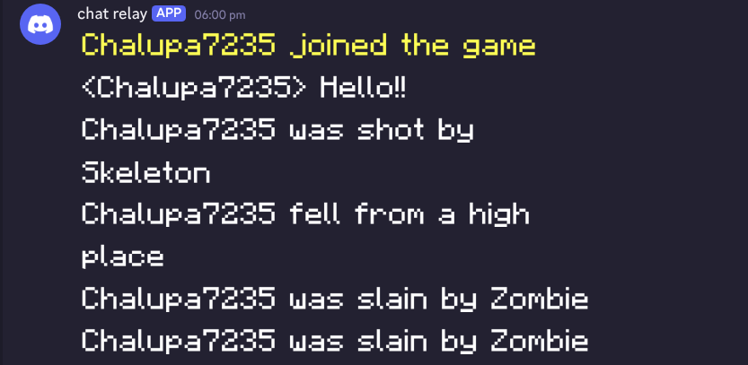
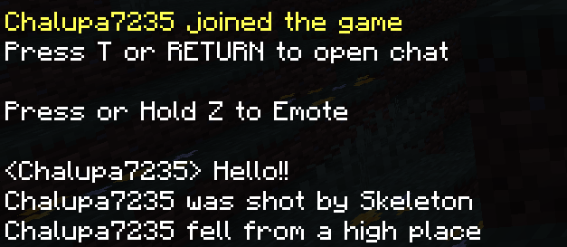
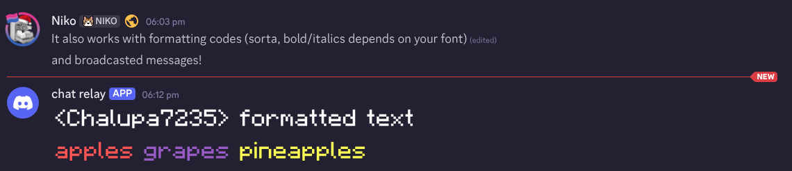
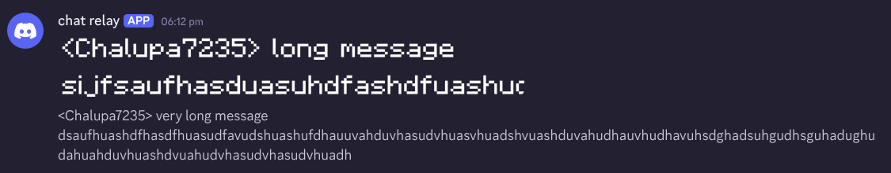
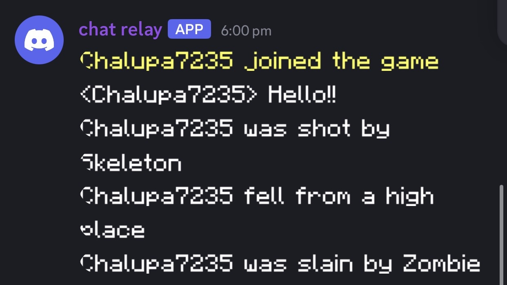

# endstone-chatrelay

> [!WARNING]
> This plugin isn't anywhere near complete, and may be buggy

A small plugin that renders minecraft chat, joins, quits, and deaths as images and sends them to a Discord webhook

It preserves minecraft colors and formatting while keeping text readable

# screenshots

Click to expand

| Discord | Minecraft |
| :---: | :---: |
|  |  |

 

# setup

1. Take the .whl file from the latest release and put it into the server’s plugins/ folder

2. Start the server once, then close it
- This creates the config file

3. Open plugins/ChatRelay/config.yml and set it like this:

- webhook_url: Your discord webhook URL *("https://discord.com/api/webhooks/...")*
- font_path: Full path to your font *("/full/path/to/your/font.ttf")* *([the one I used](https://www.dafont.com/minecraft.font))*

4. Start the server again, and it *(should)* work