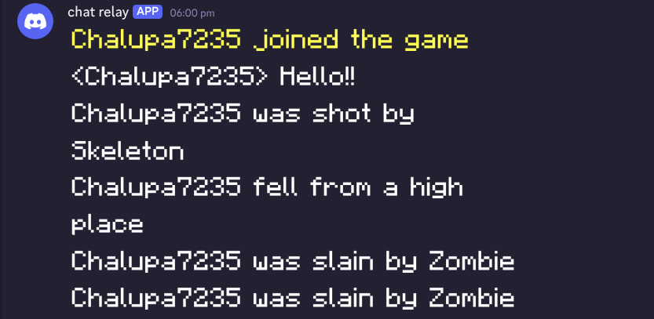
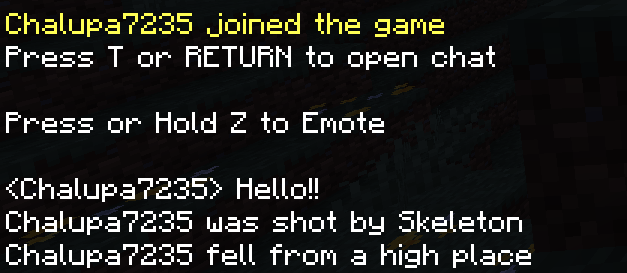
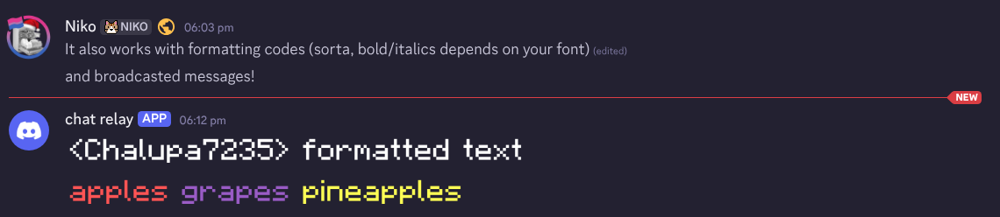
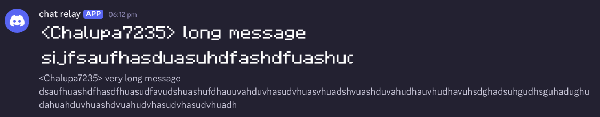
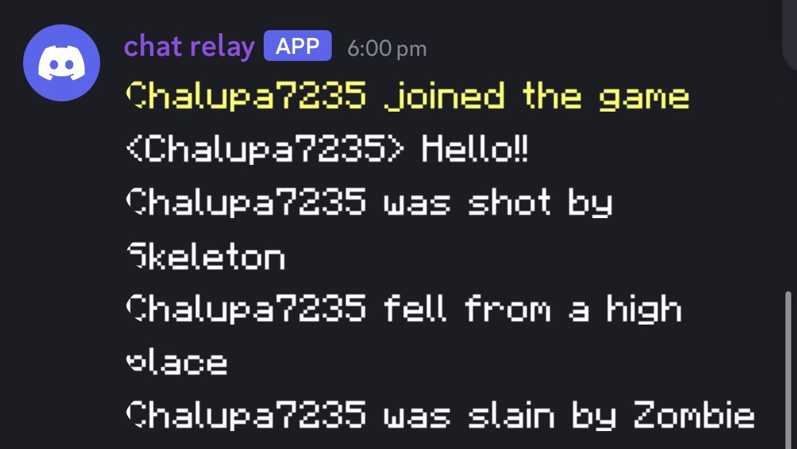

<div align="center">

# endstone-chatrelay

</div>

A plugin that renders minecraft chat, joins, quits, and deaths as images and sends them to a Discord webhook

It preserves minecraft colors and formatting while keeping text readable

# features
> - An extensive config, with three options for how messages can be sent.
> ```yaml
> %YAML 1.2
> ---
> webhook_url: ''  # Primary (and fallback) Discord webhook URL
> webhooks:
>  player: []  # List of Discord webhook URLs for player messages
>  join_leave: [] # List of Discord webhook URLs for join/leave messages
>  other: [] # List of Discord webhook URLs for other messages
>fonts: []  # List of font filenames (searched in the 'fonts' folder) or full paths. Supports fallbacks.
>message_type:
>  player: image  # ONLY applies to player messages. Options: image | plaintext | embed.
>  join_leave: image # ONLY applies to join/leave messages. Options: image | plaintext | embed.
>  other: image # ONLY applies to other messages (death, broadcast...). Options: image | plaintext | embed.
>show_warning_on_bad_config_value: false  # Whether to log warnings if a key is wrong.
>embed:
>  color:
>    player: 5614830  # Embed color for player messages (decimal format)
>    join_leave: 3066993 # Embed color for join/leave messages (decimal format)
>    other: 15158332 # Embed color for other messages (decimal format)
>  title:
>    player: Chat  # Embed title for player messages; leave blank for no title
>    join_leave: Server Event # Embed title for join/leave messages; leave blank for no title
>    other: Server Notification # Embed title for other messages; leave blank for no title
>  footer_text: Chatrelay  # Footer text for all embeds; leave blank for no footer
>  avatar:
>    player: true  # Show player avatar in player message embeds
>    join_leave: true # Show player avatar in join/leave embeds
>    other: false # Show avatar in other message embeds
>   other: false # Show avatar in other message embeds
> ```

> - Image renderer, so you can *tell* that messages are from Minecraft.
> 
> If we only had plain-text and embeds, it'd be hard to tell where the messages are from. Because the image renderer makes it *look* like it's from Minecraft, it makes that clear from the start. Clearing up confusion is the key to good UX.

# screenshots

<details>
<summary>Click to expand</summary>

| Discord | Minecraft |
| :---: | :---: |
|  |  |





</details>

# setup

1. Take the .whl file from the latest release and put it into the server’s plugins/ folder

2. Start the server once, then *(optionally)* close it
- This creates the config file

3. Open plugins/ChatRelay/config.yml and set it like this:

- webhook_url: Your discord webhook URL *("https://discord.com/api/webhooks/...")*
- font_path: Full path to your font *("/full/path/to/your/font.ttf")* *([the one I used](https://www.dafont.com/minecraft.font))*
- ...and then set everything else to your liking

4. Start the server again, and it will load. Otherwise, the logs will tell you why it didn't!